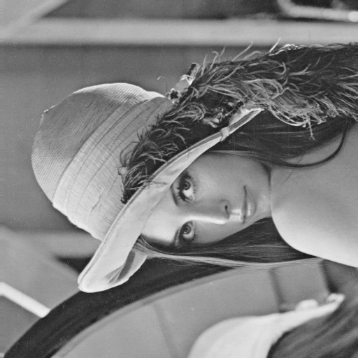
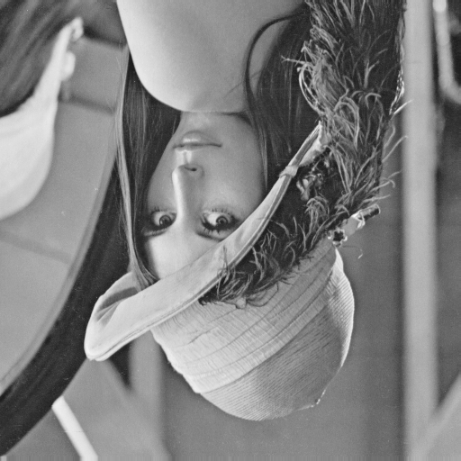
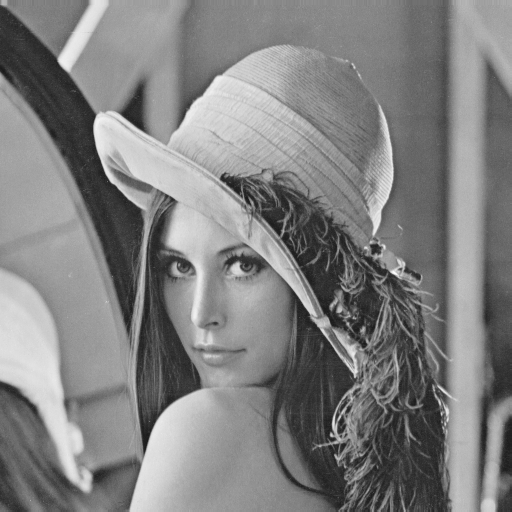
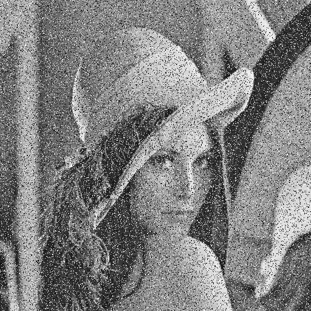
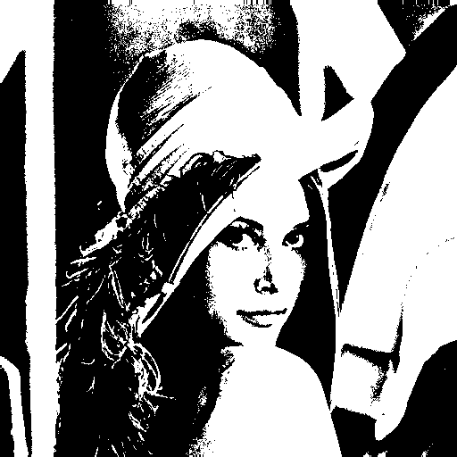
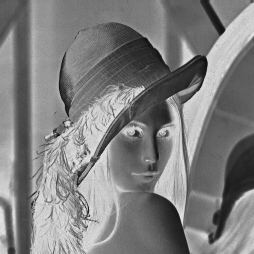

# Processing PGM images

Console application that implements simple image processing.

The application was created for private teaching purpose.

### Available options

* -h, --help (print short description how to use this application)
* --load-image=path (load the PGM image from given path)
* --save-image=path (save the processed image in given path)
* --rotate=k (rotate the image k * 90 degree)
* --reflect=axis (reflect the image relative to the axis 'x' or 'y')
* --threshold=treshold_value (threshold image relative to given value)
* --graininnes=percent (enter the graininnes of the image at the given percent)
* --negative (negate the image)
* --histogram=path (create and save histogram of the image in given path)

### Implementation

All image processing algorithms are based on simple mathematical
transformations.

---

## Screenshot

|   |     |    |
|---|:---:|---:|
|  |  |  |
|  |  |  |
|  |  |  |

---

## Technology
* C++17
* cmake
* make
---

## Requirements
* Operation system: Windows, Linux, macOS
* C++17 compiler
* cmake tool installed
* make tool installed
---

## External libraries
* utility-library: https://github.com/dmarcini/utility-library.git
* math-library: https://github.com/dmarcini/math-library.git
---

## Building & running
Example for Linux system
* install external libraries:
```
git clone library-github-url
cd path-to-clone-library
mkdir build
cd build
cmake ..
sudo make install
```
* build processing-PGM-images app
```
git clone https://github.com/dmarcini/processing-PGM-images.git
cd path-to-clone-directory
mkdir build
cd build
cmake ..
make
```
* run processing-PGM-images app
```
cd path-to-clone-directory/bin
./processing-PGM-image --selected-option(s)
```
---

## Example of use

```
path/to/binaries/processing-PGM-images --load-image=./lena.ascii.pgm
--save-image=./lena-processed.ascii.pgm --rotate=2 --reflect=y --negative
```

In this example, the following operations are performed in turn:
1. the image lena.ascii.pgm is loaded from current directory.
2. the image is rotate 180 degree
3. the image is reflected relative to axis 'y'
4. the image is negated
5. the image is saved in current directory as lena-processed.ascii.pgm

## Sources

Example image have been downloaded from:</br>
https://people.sc.fsu.edu/~jburkardt/data/pgma/pgma.html
